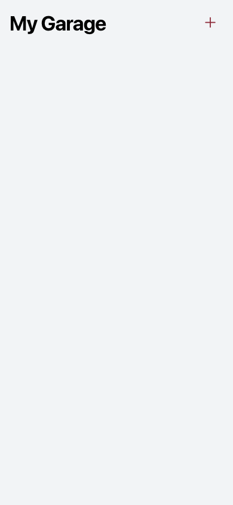
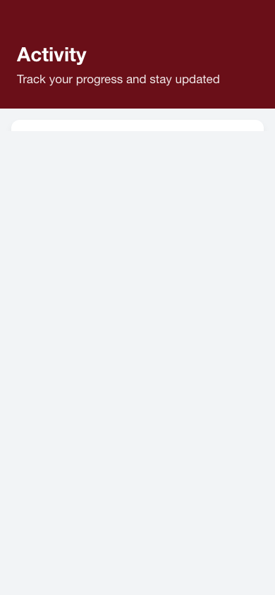
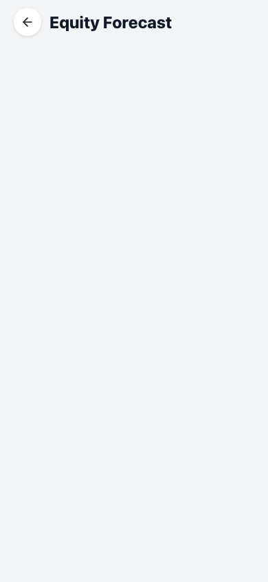
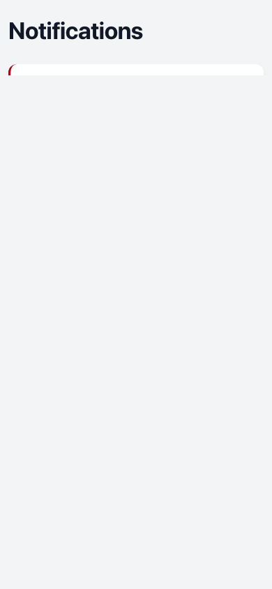

# Complete Visual Accessibility Audit Report

**Generated:** 11/20/2025, 9:50:29 PM

**Purpose:** This report provides a comprehensive visual description of the entire application, designed to be understood by someone who cannot see the screen.

---

## 1. Application Start

The application begins loading. You would see a splash screen or loading indicator while the app initializes.

---

## 2. Landing Page - Initial View

**LANDING PAGE - FIRST IMPRESSION**

This is the welcome screen users see when they first open the app.

**Visual Layout:**
- The screen has a full-page design with a gradient or solid background
- At the top, there's likely a logo or app name "Car Value Tracker" or similar branding
- The main content area contains welcome text and value propositions

**Text Content:**
The page explains what the app does - tracking car values, monitoring depreciation, and managing your vehicle portfolio.

**Interactive Elements:**
There are buttons for:
1. "Sign In" - for existing users to log into their account
2. "Sign Up" or "Get Started" - for new users to create an account
3. Possibly a "Learn More" or "Continue as Guest" option

**Color Scheme:**
The landing page uses your app's primary brand colors, likely with high contrast between text and background for readability.

**Overall Feel:**
This page should feel inviting and professional, like a financial app's welcome screen. It sets the tone for the entire application.
**Buttons Found (0):**

**Screenshot:** `screenshots/000-landing-page---initial-view.png`

---

## 3. Dashboard - Main Overview

**DASHBOARD - YOUR FINANCIAL COMMAND CENTER**

This is the main screen you see after logging in. It's designed like a financial dashboard (think banking app or investment portfolio).

**Top Section - Header:**
- App logo or name in the top left
- User profile icon or avatar in the top right
- Possibly a notifications bell icon
- The time and date may be displayed

**Hero Section (Main Stats):**
At the top of the dashboard, you'll see your most important numbers in large, prominent cards:

1. **Total Portfolio Value** - The combined current value of all your vehicles
   - Displayed as a large dollar amount (e.g., "$45,230")
   - May have a trend indicator (up/down arrow) showing if values are rising or falling
   - Percentage change over time (e.g., "+2.3% this month")

2. **Total Equity** - How much your vehicles are worth minus any loans
   - Another large dollar figure
   - Color-coded: green for positive, red if negative

3. **Monthly Change** - How much your portfolio value changed recently
   - Shows gain or loss in dollars and percentage

**Visual Style:**
- Cards have subtle shadows or borders (glass-morphism effect)
- Numbers are large and bold for easy reading
- Trend indicators use colors: green for up, red for down
- Background is clean, likely white or very light gray in light mode

**Chart Section:**
Below the main stats, there's likely a line chart showing:
- Your portfolio value over time (past week, month, or year)
- X-axis shows dates
- Y-axis shows dollar values
- The line may be colored (blue, green, or your brand color)
- Interactive: you can tap different time periods (1W, 1M, 3M, 1Y, ALL)

**Activity Feed:**
Further down, you'll see recent activities:
- "Vehicle value updated"
- "New market data available"
- "Maintenance reminder"
Each item has an icon, timestamp, and brief description.

**Overall Feel:**
Professional, clean, data-focused. Like looking at a stock portfolio or banking app. Everything is organized in cards with clear hierarchy.

**Detected Portfolio Value:** $44,500

**Screenshot:** `screenshots/001-dashboard---main-overview.png`

---

## 4. Garage - Vehicle Collection

**GARAGE - YOUR VEHICLE COLLECTION**

This screen shows all the vehicles you're tracking.

**Layout:**
The screen is organized as a scrollable list or grid of vehicle cards.

**Each Vehicle Card Contains:**

1. **Vehicle Image**
   - A photo of the car (if uploaded) or a placeholder icon
   - Takes up the top portion of the card
   - May have a subtle overlay or gradient

2. **Vehicle Name**
   - Make, model, and year (e.g., "2020 Tesla Model 3")
   - Displayed prominently below the image
   - Bold, easy-to-read font

3. **Current Value**
   - Large dollar amount showing what the car is worth now
   - Example: "$38,500"

4. **Value Change Indicator**
   - Shows if value went up or down
   - Example: "↓ $1,200 (-3.0%)" in red for decrease
   - Or: "↑ $500 (+1.5%)" in green for increase

5. **Additional Details**
   - Mileage: "45,230 miles"
   - Purchase date or ownership duration
   - Condition rating (if applicable)

6. **Action Buttons**
   - "View Details" - to see full vehicle information
   - "Edit" - to update vehicle info
   - "Delete" or three-dot menu for more options

**Top of Screen:**
- "Add Vehicle" button (prominent, likely with a + icon)
- Search or filter options if you have many vehicles
- Sort options (by value, by date added, alphabetically)

**Empty State (if no vehicles):**
If you haven't added any vehicles yet, you'll see:
- An illustration or icon of a car
- Text like "Your garage is empty"
- "Add your first vehicle" button
- Brief explanation of what you can do

**Visual Style:**
- Cards are evenly spaced with consistent padding
- Each card has a subtle shadow or border
- Images are rounded corners
- Color coding for value changes (green/red)
- Clean, organized grid or list layout

**Overall Feel:**
Like browsing a collection or inventory. Similar to a photo gallery but with financial data. Professional yet personal.

**Number of Vehicle Cards Detected:** 0

**Screenshot:** `screenshots/002-garage---vehicle-collection.png`

---

## 5. Activity Feed - Timeline

**ACTIVITY FEED - YOUR VEHICLE HISTORY TIMELINE**

This screen shows a chronological list of everything that's happened with your vehicles.

**Layout:**
A vertical timeline or feed, similar to social media or banking transaction history.

**Each Activity Item Contains:**

1. **Icon**
   - Left side of each item
   - Different icons for different activity types:
     * 📊 Chart icon for value updates
     * 🔧 Wrench for maintenance records
     * 📸 Camera for photo uploads
     * 💰 Dollar sign for financial transactions
     * 🔔 Bell for notifications

2. **Activity Title**
   - Bold text describing what happened
   - Examples:
     * "Vehicle value updated"
     * "Maintenance completed"
     * "New photo added"
     * "Market data refreshed"

3. **Description**
   - Smaller text with details
   - "2020 Tesla Model 3 value changed from $39,700 to $38,500"
   - "Oil change completed at 45,000 miles"

4. **Timestamp**
   - When it happened
   - "2 hours ago", "Yesterday", "March 15, 2024"
   - Right-aligned or below the description

5. **Visual Indicator**
   - Color coding: green for positive events, red for negative, blue for neutral
   - May have a connecting line between items (timeline style)

**Filtering Options (Top of Screen):**
- "All Activity" / "Value Changes" / "Maintenance" / "Photos" tabs
- Date range selector
- Vehicle filter (if you have multiple cars)

**Empty State:**
If no activity yet:
- Icon or illustration
- "No activity yet"
- "Start by adding a vehicle or updating values"

**Visual Style:**
- Clean, chronological list
- Alternating background colors for readability (very subtle)
- Icons are colorful and distinct
- Timestamps are muted/gray
- Each item is clearly separated

**Overall Feel:**
Like a news feed or transaction history. Easy to scan and understand what's been happening with your vehicles over time.

**Screenshot:** `screenshots/003-activity-feed---timeline.png`

---

## 6. Tools - Utility Hub

**TOOLS - YOUR VEHICLE MANAGEMENT UTILITIES**

This screen provides access to various calculators and tools for vehicle management.

**Layout:**
A grid or list of tool cards, each representing a different utility.

**Available Tools (Each as a Card):**

1. **Value Estimator**
   - Icon: 💰 or calculator symbol
   - Title: "Estimate Vehicle Value"
   - Description: "Get current market value for any vehicle"
   - Button: "Open Estimator"
   - Visual: May show a small preview or icon

2. **Depreciation Forecast**
   - Icon: 📉 chart trending down
   - Title: "Forecast Future Value"
   - Description: "Predict how your vehicle's value will change"
   - Button: "View Forecast"

3. **Loan Calculator**
   - Icon: 🏦 bank or percentage symbol
   - Title: "Calculate Loan Payments"
   - Description: "Estimate monthly payments and interest"
   - Button: "Calculate"

4. **Maintenance Tracker**
   - Icon: 🔧 wrench
   - Title: "Track Maintenance"
   - Description: "Log service history and schedule reminders"
   - Button: "Manage"

5. **Comparison Tool**
   - Icon: ⚖️ scales or comparison arrows
   - Title: "Compare Vehicles"
   - Description: "Side-by-side vehicle comparison"
   - Button: "Compare"

6. **Market Insights**
   - Icon: 📊 trending chart
   - Title: "Market Trends"
   - Description: "See how similar vehicles are performing"
   - Button: "View Insights"

**Card Design:**
- Each card is the same size
- Icon at the top or left
- Title in bold
- Description in smaller, gray text
- Action button at the bottom
- Subtle hover effect (slight elevation or color change)
- May have a colored accent (different color per tool)

**Visual Style:**
- Grid layout (2 columns on mobile, 3-4 on tablet/desktop)
- Consistent spacing between cards
- Cards have shadows or borders
- Icons are colorful and distinct
- Professional, organized appearance

**Overall Feel:**
Like a toolbox or utility drawer. Each tool is clearly labeled and easy to access. Similar to a productivity app's feature menu.

**Screenshot:** `screenshots/004-tools---utility-hub.png`

---

## 7. Profile - User Settings

**PROFILE - YOUR ACCOUNT & SETTINGS**

This screen shows your personal information and app settings.

**Top Section - User Info:**

1. **Profile Picture**
   - Large circular avatar at the top
   - Either your uploaded photo or initials in a colored circle
   - May have an "Edit" button overlay

2. **Name**
   - Your full name displayed prominently
   - Below the avatar

3. **Email**
   - Your email address
   - Smaller, gray text

4. **Member Since**
   - "Member since March 2024" or similar
   - Shows account age

**Statistics Section:**
Quick stats about your usage:
- "3 Vehicles Tracked"
- "12 Value Updates"
- "5 Maintenance Records"
Each with an icon and number

**Settings Sections:**

**Account Settings:**
- Edit Profile (name, email, photo)
- Change Password
- Notification Preferences
- Privacy Settings
Each item is a row with:
- Icon on the left
- Label text
- Right arrow (>) indicating it's tappable
- Some may have toggle switches

**App Preferences:**
- Theme: Light/Dark mode toggle
- Currency: USD, EUR, etc.
- Units: Miles/Kilometers
- Language selection

**Data Management:**
- Export Data
- Backup & Sync
- Clear Cache

**Subscription/Premium:**
- Current plan (Free/Premium)
- "Upgrade to Premium" button if on free plan
- Features list
- Billing information

**Support:**
- Help & FAQ
- Contact Support
- Rate the App
- Terms of Service
- Privacy Policy

**Danger Zone:**
- Log Out button (prominent)
- Delete Account (red text, at bottom)

**Visual Style:**
- Grouped sections with headers
- Each setting is a clean row
- Icons are consistent and colorful
- Toggle switches are iOS/Android native style
- Divider lines between items
- White/light background for each section

**Overall Feel:**
Clean, organized settings page. Similar to iOS Settings or any modern app's profile section. Easy to navigate and find what you need.

**Screenshot:** `screenshots/005-profile---user-settings.png`

---

## 8. Value Estimator Tool

**VALUE ESTIMATOR - GET CURRENT MARKET VALUE**

This tool helps you estimate what a vehicle is worth right now.

**Form Layout:**
A step-by-step form with clear sections:

**Section 1: Vehicle Information**

1. **Year Selector**
   - Dropdown or picker
   - Range from current year back to ~1990
   - Label: "Year"
   - Example: "2020"

2. **Make Input**
   - Dropdown with popular brands
   - Searchable: "Tesla", "Toyota", "Ford", etc.
   - Label: "Make"
   - May have brand logos

3. **Model Input**
   - Dropdown (populated based on make)
   - Label: "Model"
   - Example: "Model 3", "Camry", "F-150"

4. **Trim Level**
   - Optional dropdown
   - Label: "Trim (Optional)"
   - Example: "Long Range", "XLE", "Lariat"

**Section 2: Condition Details**

5. **Mileage Input**
   - Number field
   - Label: "Current Mileage"
   - Placeholder: "45,000"
   - Unit indicator: "miles" or "km"

6. **Condition Rating**
   - Visual selector with options:
     * Excellent (5 stars, green)
     * Good (4 stars, blue)
     * Fair (3 stars, yellow)
     * Poor (2 stars, orange)
   - Each option has description
   - Selected option is highlighted

7. **Location**
   - Zip code or city input
   - Label: "Location"
   - Helps with regional pricing
   - May have GPS button to auto-detect

**Section 3: Optional Details**

8. **Color**
   - Dropdown or color picker
   - Common colors listed

9. **Features**
   - Checkboxes for:
     * Leather seats
     * Sunroof
     * Navigation
     * Premium sound
     * etc.

**Action Button:**
- Large "Get Estimate" button at bottom
- Primary color (blue/green)
- Full width
- May show loading spinner when calculating

**Results Display (After Submission):**

**Estimated Value Card:**
- Large dollar amount: "$38,500"
- Range: "$36,000 - $41,000"
- Confidence indicator
- "Based on 127 similar vehicles"

**Value Breakdown:**
- Base value
- Mileage adjustment
- Condition adjustment
- Location adjustment
- Features adjustment

**Market Insights:**
- "Similar vehicles in your area"
- Price trend chart
- "Good time to sell" or "Hold for now" recommendation

**Actions:**
- "Add to Garage" button
- "Share Estimate" button
- "Refine Estimate" to adjust inputs

**Visual Style:**
- Clean form with clear labels
- Input fields have borders and focus states
- Validation messages if fields are incorrect
- Progress indicator if multi-step
- Results are visually distinct from form
- Charts and graphs for market data

**Overall Feel:**
Professional calculator tool. Like using a mortgage calculator or tax estimator. Clear, step-by-step, with helpful guidance.

**Screenshot:** `screenshots/006-value-estimator-tool.png`

---

## 9. Depreciation Forecast Tool

**DEPRECIATION FORECAST - PREDICT FUTURE VALUE**

This tool shows you how your vehicle's value will likely change over time.

**Input Section:**

1. **Vehicle Selector**
   - Dropdown to choose from your garage
   - Or option to enter vehicle details manually
   - Shows: "2020 Tesla Model 3" (example)

2. **Current Value**
   - Pre-filled from your garage or editable
   - "$38,500" (example)

3. **Time Period Selector**
   - Buttons or slider for:
     * 1 Year
     * 3 Years
     * 5 Years
     * 10 Years
   - Selected period is highlighted

**Forecast Display:**

**Main Chart:**
- Large line graph showing value over time
- X-axis: Time (months/years)
- Y-axis: Dollar value
- The line trends downward (depreciation)
- May show confidence bands (shaded area around the line)
- Current value marked with a dot
- Future projected value at end point

**Key Predictions:**

1. **Projected Value**
   - Large number: "In 5 years: $28,300"
   - Percentage loss: "(-26.5%)"
   - Color-coded (usually red/orange for loss)

2. **Total Depreciation**
   - "$10,200 over 5 years"
   - "Average $2,040 per year"

3. **Best Time to Sell**
   - Recommendation: "Sell within 2 years to minimize loss"
   - Reasoning provided

**Comparison Section:**
- "Similar vehicles depreciate at 15% per year"
- "Your vehicle: 12% per year (better than average)"
- Bar chart comparing your vehicle to market average

**Factors Affecting Forecast:**
List of considerations:
- Current mileage
- Vehicle age
- Market trends
- Brand reliability
- Historical data

**Interactive Elements:**
- Hover over chart to see specific values at any point
- Toggle between optimistic/realistic/pessimistic scenarios
- Adjust assumptions (mileage per year, condition changes)

**Action Buttons:**
- "Save Forecast"
- "Share Report"
- "Set Value Alert" (notify when value drops to X)

**Visual Style:**
- Professional financial chart
- Clean, data-focused design
- Color gradient on chart (green to yellow to red)
- Clear labels and legends
- Responsive to screen size

**Overall Feel:**
Like a stock market forecast or retirement calculator. Data-driven, professional, helps you make informed decisions about when to sell or hold your vehicle.

**Screenshot:** `screenshots/007-depreciation-forecast-tool.png`

---

## 10. Notifications Center

**NOTIFICATIONS - STAY INFORMED**

This screen shows all your app notifications and alerts.

**Layout:**
A list of notification cards, newest at the top.

**Each Notification Contains:**

1. **Icon/Badge**
   - Left side indicator
   - Different colors/icons for different types:
     * 📉 Red for value drops
     * 📈 Green for value increases
     * 🔔 Blue for general alerts
     * 🔧 Orange for maintenance reminders

2. **Title**
   - Bold text: "Vehicle Value Decreased"
   - "Maintenance Due Soon"
   - "Market Update Available"

3. **Message**
   - Details: "Your 2020 Tesla Model 3 value dropped by $1,200"
   - "Oil change recommended at 45,000 miles"

4. **Timestamp**
   - "5 minutes ago"
   - "Yesterday at 3:30 PM"
   - "March 15, 2024"

5. **Action Buttons**
   - "View Details"
   - "Dismiss"
   - "Mark as Read"

**Top Controls:**
- "Mark All as Read" button
- Filter: "All" / "Unread" / "Value Alerts" / "Maintenance"
- Settings icon (notification preferences)

**Unread Indicators:**
- Unread notifications have:
  * Slightly bolder text
  * Colored background (very light blue/gray)
  * Blue dot on the left

**Empty State:**
If no notifications:
- Bell icon with checkmark
- "You're all caught up!"
- "No new notifications"

**Visual Style:**
- Clean list layout
- Clear separation between items
- Color-coded by importance
- Swipe gestures may work (swipe to dismiss)
- Pull to refresh

**Overall Feel:**
Like email inbox or social media notifications. Easy to scan, clear hierarchy, actionable.

**Screenshot:** `screenshots/008-notifications-center.png`

---

